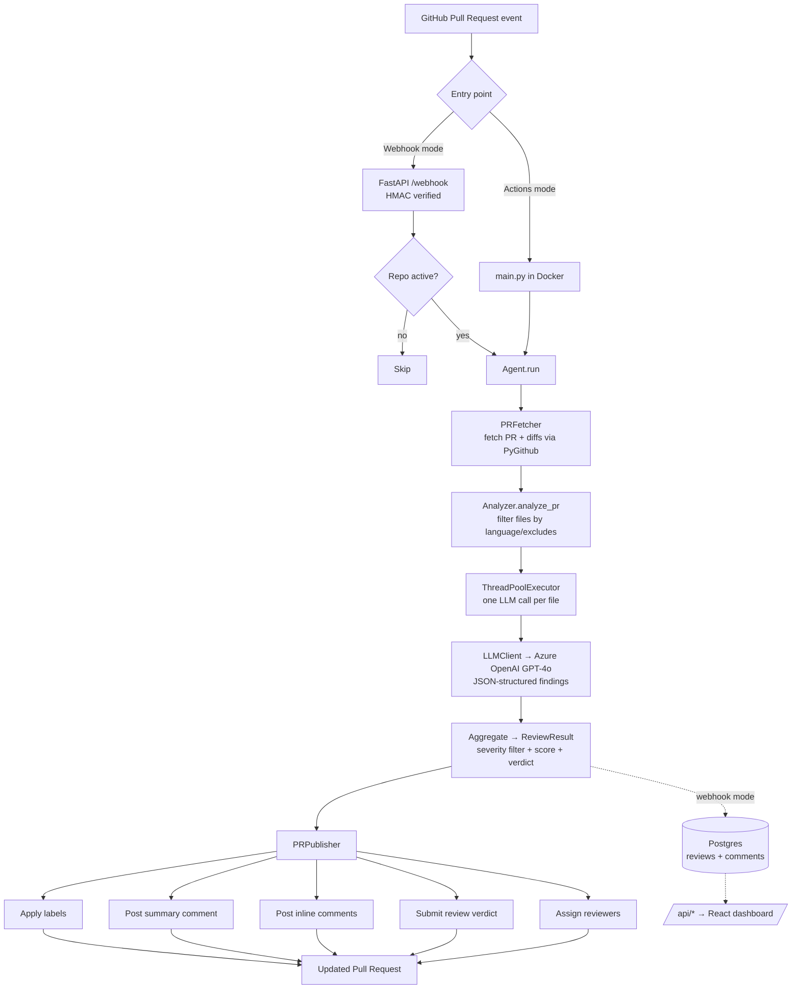

# PRLens

[](https://www.python.org/downloads/release/python-3110/)
[](#license)
[](#testing)
[](#testing)
[](#evaluation-results)

**PRLens is an AI code reviewer for GitHub Pull Requests.** It reads the diff of every PR, uses GPT-4o (via Azure OpenAI) to find real security, quality, and performance issues, and posts inline comments, a quality score, labels, and a formal review verdict — all automatically. Drop in a workflow file or install it as a GitHub App; end users get reviews with zero manual effort.

It also ships a **web dashboard**: sign in with GitHub, connect repositories in a click, tune each repo's review settings, and browse the review history and quality trends PRLens has recorded.

> Built as an internship project at **Smartovate**.

---

## Table of contents

- [What a review looks like](#what-a-review-looks-like)
- [Features](#features)
- [Installation — GitHub Actions mode](#installation--github-actions-mode)
- [Installation — Webhook mode](#installation--webhook-mode)
- [The dashboard](#the-dashboard)
- [The admin section](#the-admin-section)
- [Configuration reference](#configuration-reference)
- [Environment variables](#environment-variables)
- [GitHub App setup](#github-app-setup)
- [Architecture](#architecture)
- [Evaluation results](#evaluation-results)
- [Testing](#testing)
- [Limitations and known issues](#limitations-and-known-issues)
- [Contributing](#contributing)
- [License](#license)

---

## What a review looks like

When PRLens reviews a PR, it posts a summary comment and inline comments on the exact diff lines.

**Summary comment:**

```markdown
## PRLens Review Summary

⚠️ Changes Requested

**Score:** 61/100

### Issues by Severity
- critical: 1
- warning: 2

### Positive Observations
- Input is validated before use in `create_user`

### Recommendations
- Move the hardcoded token into an environment variable
```

**Inline comment on a specific line:**

```markdown
🔴 Hardcoded API key committed to source. Anyone with repo access can read
this secret, and it will remain in git history even if removed later.

💡 **Suggestion:** Load the key from an environment variable, e.g.
`API_KEY = os.environ["OPENAI_API_KEY"]`.
```

Severity is shown with an emoji prefix: 🔴 critical · 🟠 error · 🟡 warning · 🔵 info.

PRLens also applies labels (e.g. `needs-changes`, `security-concern`), submits a formal review (**Approve** / **Request changes** / **Comment**), and optionally requests reviewers.

---

## Features

**Detection**

- **Security** — OWASP Top 10, SQL injection, hardcoded secrets, path traversal, command injection, XSS, unsafe deserialization, auth flaws.
- **Quality** — excessive nesting, code duplication, god functions, bare `except`, poor abstraction, error-handling problems.
- **Performance** — N+1 query patterns, expensive operations inside loops, blocking calls, inefficient algorithms.
- **Style & documentation** — confusing naming, missing validation, and documentation gaps that cause genuine maintainability problems.

**Scoring & verdict**

- **Quality score (0–100)** using severity-weighted penalties: critical `-25`, error `-10`, warning `-4`, info `-1`.
- **Formal review verdict** — Approve, Request changes, or Comment, driven by configurable score thresholds and the presence of critical issues.
- **Graceful failure handling** — distinct `Incomplete` and `Total failure` outcomes when some or all files can't be analyzed, instead of a silent crash.

**PR automation**

- **Inline comments** on exact diff lines with emoji severity indicators and concrete fix suggestions.
- **Structured Markdown summary** with score, severity breakdown, positives, and recommendations.
- **Labels** applied automatically: `ai-approved`, `needs-changes`, `incomplete-review`, `failed_review`, `security-concern`, `large-pr`, `documentation-needed`.
- **Reviewer assignment** based on a configurable issue-type → reviewer mapping (supports individuals and teams).

**Dashboard**

- **Sign in with GitHub** (OAuth), then connect any repository you can admin — no YAML, no secrets to copy.
- **Per-repo settings** — severity floor, languages, excluded files, score thresholds, reviewer mapping — stored in Postgres and applied to that repo's reviews.
- **Review history & trends** — every review PRLens posts is recorded, with score trends, issue-type breakdowns, and per-PR comment detail.
- **Active toggle** — pause reviews on a repo without disconnecting it.
- **Admin section** — a deployment-wide, read-only view for operators: every account, every connected repo, every review, and the failure rate across all of them.

**Engineering**

- **Parallel analysis** — one LLM call per file, fanned out with a `ThreadPoolExecutor`.
- **GitHub App auth** — JWT-signed installation tokens with automatic refresh before expiry (also supports a plain PAT).
- **Two deployment modes** — GitHub Actions (no server) or a FastAPI webhook server (no per-repo setup, plus the dashboard).
- **Validated** — 117 unit tests, 99% coverage of the reviewer core, plus an eval harness reporting **86.7% precision** (spec requires ≥ 70%).

---

## Installation — GitHub Actions mode

Runs entirely inside GitHub Actions. No server to host — add one workflow file to any repository.

**Step 1 — Add repository secrets**

In the target repo: **Settings → Secrets and variables → Actions → New repository secret**.

| Secret | Value |
| --- | --- |
| `AZURE_OPENAI_API_KEY` | Your Azure OpenAI API key |
| `AZURE_OPENAI_ENDPOINT` | Your Azure OpenAI endpoint, e.g. `https://your-resource.openai.azure.com/` |

`GITHUB_TOKEN` is provided automatically by Actions — you don't create it.

**Step 2 — Add the workflow**

Create `.github/workflows/prlens.yml`:

```yaml
name: PRLens

on:
  pull_request:
    types: [opened, synchronize, reopened]

jobs:
  review:
    runs-on: ubuntu-latest
    permissions:
      pull-requests: write
      contents: read
    steps:
      - name: Checkout
        uses: actions/checkout@v4

      - name: Run AI Review
        uses: IsmailMechkene/prlens@main
        with:
          github_token: ${{ secrets.GITHUB_TOKEN }}
          openai_api_key: ${{ secrets.AZURE_OPENAI_API_KEY }}
          openai_endpoint: ${{ secrets.AZURE_OPENAI_ENDPOINT }}
```

**Step 3 — (Optional) tune behavior**

Add a `.aireviewer.yml` at the repo root to customize languages, thresholds, and reviewers — see the [Configuration reference](#configuration-reference). Without it, sensible defaults apply.

**Step 4 — Open a PR**

That's it. On the next PR (opened, updated, or reopened) PRLens runs and posts its review. Comments are attributed to `github-actions[bot]` in this mode.

### Action inputs

| Input | Required | Description |
| --- | --- | --- |
| `openai_api_key` | ✅ | Azure OpenAI API key. |
| `openai_endpoint` | ✅ | Azure OpenAI endpoint / base URL. |
| `github_token` | — | GitHub token (PAT or `GITHUB_TOKEN`). Used when App credentials are not provided. |
| `app_id` | — | GitHub App ID (App auth). |
| `app_private_key` | — | GitHub App private key, **base64-encoded** (see note below). |
| `app_installation_id` | — | GitHub App installation ID. |

> **Note on `app_private_key`:** multi-line PEM values don't survive being passed through a Docker action's environment reliably, so PRLens expects the key **base64-encoded** on a single line. Generate it with `base64 -w0 your-app.private-key.pem` (Linux) or `base64 -i your-app.private-key.pem` (macOS) and store the output as the secret.

---

## Installation — Webhook mode

Run PRLens as a long-lived FastAPI server. Install the GitHub App once, and every repo it's added to gets reviews with **zero per-repo setup**. This is also the mode that serves the [dashboard](#the-dashboard).

**Prerequisites**

- Python 3.11
- A registered GitHub App (see [GitHub App setup](#github-app-setup))
- Azure OpenAI access (API key + endpoint)
- Postgres — optional for reviewing, required for the dashboard

**Step 1 — Clone and install**

```bash
git clone https://github.com/IsmailMechkene/prlens.git
cd prlens
python -m venv .venv
source .venv/bin/activate          # Windows: .venv\Scripts\activate
pip install -r requirements.txt
pip install "uvicorn[standard]"    # ASGI server used to run the app
```

**Step 2 — Configure the environment**

Copy the example env file and fill it in:

```bash
cp .env.example .env
```

See the [Environment variables](#environment-variables) reference for the full list. The minimum for reviewing PRs:

```dotenv
# Azure OpenAI
AZURE_OPENAI_API_KEY=your_azure_openai_api_key
AZURE_OPENAI_ENDPOINT=https://your-resource.openai.azure.com/

# GitHub App auth
GITHUB_APP_ID=123456
GITHUB_APP_INSTALLATION_ID=987654
GITHUB_APP_PRIVATE_KEY_PATH=./prlens-reviewer.pem

# Webhook signature verification (must match the secret set in the App settings)
GITHUB_WEBHOOK_SECRET=your_webhook_secret
```

> Auth precedence: if `GITHUB_APP_ID` is set, PRLens authenticates as a GitHub App; otherwise it falls back to `GITHUB_TOKEN`. The private key can be supplied as a file path (`GITHUB_APP_PRIVATE_KEY_PATH`), raw PEM (`GITHUB_APP_PRIVATE_KEY`), or base64 (`GITHUB_APP_PRIVATE_KEY_B64`). In a container, use the base64 form — `*.pem` is both git- and docker-ignored, so a path can't resolve inside a built image.

**Step 3 — Run the server**

```bash
uvicorn prlens.webhook.app:app --host 0.0.0.0 --port 8000
```

The server verifies the `X-Hub-Signature-256` header against `GITHUB_WEBHOOK_SECRET`, ignores non-`pull_request` events, and only acts on `opened`, `synchronize`, and `reopened` actions. Review work runs in a background task, so GitHub gets an immediate acknowledgement while analysis proceeds.

**Step 4 — Expose it to GitHub**

Point your GitHub App's webhook URL at `https://<your-host>/webhook`. For local development, tunnel it:

```bash
# example using a tunneling tool of your choice
ngrok http 8000
# then set the App webhook URL to https://<tunnel-id>.ngrok.io/webhook
```

Without `DATABASE_URL`, the server still reviews PRs — it falls back to each repo's `.aireviewer.yml` and simply stores nothing. Set it to unlock the dashboard.

---

## The dashboard

A React + TypeScript single-page app (`dashboard/`) served against the same FastAPI backend. Users sign in with GitHub OAuth, connect repositories, and manage reviews without touching a config file.

**What it does**

- **Connect repos** — lists the repositories you can administer and connects them to the PRLens GitHub App in one click; disconnecting removes the review history and detaches the repo from the App.
- **Per-repo settings** — the same fields as `.aireviewer.yml`, edited in the UI and persisted per repo. Settings stored here take precedence over the file for that repo.
- **Active toggle** — flip a repo inactive to pause its reviews (the webhook returns early) while keeping its history.
- **Stats & history** — repos connected, reviews run, average score, issue-type breakdown, score trend over time, and the full comment detail of each recorded review.

**Setup**

1. **Register a GitHub OAuth app** (this is separate from the GitHub App): GitHub → **Settings → Developer settings → OAuth Apps → New OAuth App**. Set the callback URL to `https://<your-backend>/auth/callback`. Collect the client ID and secret.

2. **Set the backend env vars** — `DATABASE_URL`, `SESSION_SECRET`, `GITHUB_OAUTH_CLIENT_ID`, `GITHUB_OAUTH_CLIENT_SECRET`, and `FRONTEND_URL` (the origin the SPA is served from; it's both the CORS allow-list and the post-OAuth redirect target). See [Environment variables](#environment-variables).

3. **Run the frontend:**

   ```bash
   cd dashboard
   npm install
   echo "VITE_API_BASE_URL=http://localhost:8000" > .env.local
   npm run dev        # http://localhost:5173
   ```

   For production, `npm run build` emits a static bundle to `dashboard/dist/`. Leave `VITE_API_BASE_URL` unset if the API is served from the same origin as the SPA.

**Auth model.** The OAuth callback mints a session JWT (signed with `SESSION_SECRET`) and redirects to the dashboard with it in the query string. The SPA stores it in `localStorage` and sends it as `Authorization: Bearer …` on every request — not a cookie, because the API and the SPA typically live on different domains. A 401 from any endpoint drops the token and restarts the OAuth flow.

> `SESSION_SECRET` **must** be set in production and identical across replicas. Unset, the app falls back to a random per-process key and logs a warning at boot — every restart would then invalidate all sessions.

**API surface**

| Method | Path | Purpose |
| --- | --- | --- |
| `GET` | `/` | Health check → `{"status": "ok", "service": "PRLens"}` |
| `POST` | `/webhook` | GitHub `pull_request` events (HMAC-SHA256 verified) |
| `GET` | `/auth/github` | Start the OAuth flow |
| `GET` | `/auth/callback` | OAuth callback; mints the session JWT |
| `GET` | `/api/user` | The signed-in user |
| `GET` | `/api/stats` | Dashboard tiles, issue breakdown, score trend |
| `GET` | `/api/repos` | Connected repos |
| `GET` | `/api/repos/{name}` | One repo, with its settings |
| `GET` | `/api/github/repos` | Repos on GitHub available to connect |
| `POST` | `/api/repos/{name}/enable` | Connect a repo |
| `DELETE` | `/api/repos/{name}` | Disconnect a repo and delete its history |
| `PUT` | `/api/repos/{name}/settings` | Update a repo's review settings |
| `PUT` | `/api/repos/{name}/active` | Pause / resume reviews for a repo |
| `GET` | `/api/reviews` | Recent reviews across all repos |
| `GET` | `/api/repos/{name}/reviews` | Reviews for one repo |
| `GET` | `/api/admin/stats` | **Admin.** Deployment-wide tiles |
| `GET` | `/api/admin/users` | **Admin.** Every account, with repo/review counts |
| `GET` | `/api/admin/users/{id}` | **Admin.** One account: its repos and reviews |
| `GET` | `/api/admin/installations` | **Admin.** Every installation, across all users |
| `GET` | `/api/admin/reviews` | **Admin.** Global review feed (`?status=failed`) |

Everything under `/api` requires the bearer token. Everything under `/api/admin` additionally requires the caller's `role` to be `admin`, and answers `403` otherwise.

---

## The admin section

The dashboard is per-user: `/api/stats`, `/api/repos` and the rest are all scoped to the signed-in account, so nobody — including you — can see how the deployment as a whole is doing. The admin section is that missing view.

**What it shows**

- **Deployment tiles** — total users (and how many are admins), total repos connected and how many are active, total reviews run, and **failed reviews** as a count and a share of all runs. A failure rate climbing across *unrelated* repos and users is what an Azure OpenAI outage looks like from the inside; a per-user dashboard structurally cannot show that.
- **Users** — every account with its repo count, review count and last review, and a drill-down page per user. This is the support view: "why isn't PRLens reviewing my repo" is usually answered by whether the repo is connected at all, and whether it's active.
- **All installations** — every repo × user pairing. Because the unique key is `(user_id, repo_name)`, a repo connected by two people has two rows, which is what makes the duplicate-installation limitation below visible at all.
- **Global review feed** — every review across every repo, filterable down to just the runs that broke.

It is **read-only**. It reports on other users' repos; it never edits, disconnects or reconfigures them.

**Becoming an admin**

`User.role` is `user` or `admin`. There is deliberately **no endpoint and no button** that grants the role — an admin surface that can mint more admins turns one compromised admin session, or one bug in the role check, into a permanent privilege-escalation path. Promotion is an out-of-band action taken by somebody who already has database access:

```bash
# the user must have signed in through GitHub at least once — the row has to exist
python -m scripts.set_admin --handle IsmailMechkene

python -m scripts.set_admin --list                     # every account and its role
python -m scripts.set_admin --handle someone --revoke  # demote (refuses on the last admin)
```

The role is read from the database row on **every** request, not from a claim baked into the session JWT, so revoking it takes effect immediately rather than whenever the user's 30-day token happens to expire.

**Getting to it.** An admin keeps an ordinary account — their own repos, their own dashboard. The admin section is an extra entry in the sidebar (`/admin`), not a mode the account is switched into, so an admin moves between the global view and their personal dashboard the way they move between any two pages. Non-admins never see the link, and a hand-typed `/admin` URL bounces them back to their dashboard — though that redirect is only cosmetic: the actual enforcement is the `403` from the API.

**Schema note.** `role` is added to the `users` table at startup if it isn't there (see [Limitations](#limitations-and-known-issues) — there's no migration tool), and existing accounts are backfilled to `user`. Nobody is silently promoted by deploying this.

---

## Configuration reference

PRLens reads an optional `.aireviewer.yml` from the repository root. If the file is missing, all defaults below apply. In webhook mode, settings saved in the dashboard for a repo take precedence over the file.

| Field | Type | Default | Description |
| --- | --- | --- | --- |
| `llm_model` | `string` | `gpt-4o` | Azure OpenAI model / deployment name used for review. |
| `min_severity` | `info` \| `warning` \| `error` \| `critical` | `info` | Comments below this severity are dropped before publishing. |
| `target_languages` | `list[string]` | `[]` | Restrict which languages are reviewed. Supported: `python`, `javascript`, `typescript`, `java`. Empty means no language filter. |
| `excluded_files` | `list[string]` | `[]` | Glob patterns for files to skip (e.g. `*.lock`, `dist/**`). |
| `reviewers_mapping` | `map<type, string>` | `{}` | Maps an issue type (`security`, `performance`, `quality`, `style`, `documentation`) to a reviewer. Use a username, or `team:<slug>` for a team. |
| `max_workers` | `int` | `5` | Number of files analyzed in parallel. |
| `approve_threshold` | `int` | `80` | Score **strictly above** this (and no critical issues) → **Approve**. |
| `changes_threshold` | `int` | `50` | Score **below** this (or any critical issue) → **Request changes**. |
| `large_pr_threshold` | `int` | `20` | PRs changing more files than this get the `large-pr` label. |

**Example `.aireviewer.yml`:**

```yaml
llm_model: gpt-4o
min_severity: info

target_languages:
  - python
  - javascript
  - typescript
  - java

excluded_files:
  - "*.lock"
  - "*.min.js"
  - "dist/**"
  - "build/**"

reviewers_mapping:
  security: "IsmailMechkene"
  performance: "Kurasaki-67"
  quality: "team:senior-devs"

max_workers: 5
approve_threshold: 80
changes_threshold: 50
large_pr_threshold: 20
```

> Reviewer assignment only fires when a PR has critical issues, and requested reviewers must be collaborators on the repository — otherwise GitHub rejects the request and PRLens logs a warning without failing the run.

---

## Environment variables

| Variable | Needed for | Description |
| --- | --- | --- |
| `AZURE_OPENAI_API_KEY` | Always | Azure OpenAI API key. |
| `AZURE_OPENAI_ENDPOINT` | Always | Azure OpenAI endpoint / base URL. |
| `GITHUB_TOKEN` | PAT auth | Fallback token when GitHub App credentials aren't set. Needs `repo` scope. |
| `GITHUB_APP_ID` | App auth | The GitHub App PRLens reviews as. Its presence selects App auth over `GITHUB_TOKEN`. |
| `GITHUB_APP_INSTALLATION_ID` | App auth | Installation ID of that App. |
| `GITHUB_APP_PRIVATE_KEY_PATH` | App auth | Path to the App's `.pem`. Local checkouts only — see `_B64` below. |
| `GITHUB_APP_PRIVATE_KEY` | App auth | The raw PEM, as an alternative to the path. |
| `GITHUB_APP_PRIVATE_KEY_B64` | App auth | The PEM, base64-encoded. **Use this in containers** (`base64 -w0 prlens-reviewer.pem`). |
| `GITHUB_WEBHOOK_SECRET` | Webhook mode | Shared secret GitHub signs deliveries with. `/webhook` returns 500 until it's set, so a delivery is never processed unverified. |
| `DATABASE_URL` | Dashboard | Postgres connection string. Without it the server still reviews PRs (falling back to `.aireviewer.yml`) but stores nothing. |
| `SESSION_SECRET` | Dashboard | Signing key for session JWTs. Must be set in production and identical across replicas. Generate with `python -c "import secrets; print(secrets.token_urlsafe(48))"`. |
| `GITHUB_OAUTH_CLIENT_ID` | Dashboard | OAuth app used to sign users in. |
| `GITHUB_OAUTH_CLIENT_SECRET` | Dashboard | OAuth app secret. |
| `FRONTEND_URL` | Dashboard | Origin(s) the SPA is served from — the CORS allow-list, and (first entry) the post-OAuth redirect target. Comma-separated, no trailing slash. Defaults to `http://localhost:5173`. |
| `VITE_API_BASE_URL` | Dashboard (build) | Frontend-side: the backend's origin. Leave unset when both are same-origin. |

---

## GitHub App setup

Required for **Webhook mode** (and optional App auth in Actions mode). The dashboard additionally needs a separate **OAuth app** — see [The dashboard](#the-dashboard).

**1. Register the App** — GitHub → **Settings → Developer settings → GitHub Apps → New GitHub App**.

- **Webhook URL:** `https://<your-host>/webhook`
- **Webhook secret:** a strong random string (must match `GITHUB_WEBHOOK_SECRET`)

**2. Repository permissions**

| Permission | Access | Why |
| --- | --- | --- |
| Pull requests | Read & write | Post comments, reviews, labels, and reviewer requests |
| Contents | Read | Read file diffs |
| Metadata | Read | Mandatory baseline access |

**3. Subscribe to events**

- ☑️ **Pull request**

**4. Collect credentials**

- **App ID** → `GITHUB_APP_ID`
- **Generate a private key** (downloads a `.pem`) → `GITHUB_APP_PRIVATE_KEY_PATH` / `_B64`
- **Install the App** on your account/org, then read the **Installation ID** from the install URL → `GITHUB_APP_INSTALLATION_ID`

PRLens signs a short-lived JWT with the private key, exchanges it for an installation access token, and automatically refreshes the token before it expires.

---

## Architecture

PRLens shares one core pipeline (`Agent`) behind two entry points. In Actions mode, `main.py` runs once per PR inside a Docker container; in Webhook mode, the FastAPI server invokes the same pipeline per event, and additionally persists the result and serves the dashboard API.



In webhook mode the per-repo `Settings` are built from the `Installation` row the dashboard writes, falling back to `.aireviewer.yml` when the repo isn't connected.

**Module layout**

```
prlens/
├── config/settings.py     # .aireviewer.yml loading, Settings model, file filtering
├── core/agent.py          # Orchestrates the review pipeline
├── github/
│   ├── client.py          # Auth (GitHub App JWT / PAT), token refresh
│   ├── pr_fetcher.py      # Fetch PR + map to internal models
│   └── pr_publisher.py    # Labels, summary, inline comments, verdict, reviewers
├── llm/
│   ├── client.py          # Azure OpenAI (OpenAI SDK) wrapper
│   ├── analyzer.py        # Parallel per-file analysis, scoring
│   └── prompts.py         # System + user prompts, strict JSON contract
├── models/                # Pydantic models: PR, FileChange, ReviewComment, ...
└── webhook/app.py         # FastAPI: webhook + OAuth + /api for the dashboard

auth/github_oauth.py       # Dashboard sign-in (OAuth code exchange)
database/
├── models.py              # User (+ role), Installation, Review, ReviewComment
└── connection.py          # Engine/session (DATABASE_URL), startup schema patches

dashboard/                 # React 19 + TypeScript + Vite SPA
├── src/pages/             # Landing, Dashboard, RepoDetail, Connect, Admin, Docs, ...
├── src/components/        # Layout (sidebar, auth/admin guards), repo, connect, ui
└── src/lib/api.ts         # Typed API client, bearer-token auth

scripts/set_admin.py       # Grant/revoke the admin role (the only way to)
main.py                    # Actions-mode entry point
eval/                      # Offline evaluation harness
```

---

## Evaluation results

PRLens ships with an offline eval harness (`eval/`) of hand-crafted diffs with known-good expectations. A case passes if the reviewer returns a finding of the expected type at or above the expected severity — and for "clean" cases, if it returns **no** comments.

Run it against your Azure OpenAI deployment:

```bash
python -m eval.run_eval
```

**Latest run — 13 / 15 cases, 86.7% precision** (spec requires ≥ 70%):

| Category | Cases | Passed | What it checks |
| --- | --- | --- | --- |
| Security | 5 | 5 | Hardcoded secrets, SQL injection, path traversal, command injection |
| Quality | 4 | 4 | Deep nesting, duplication, bare `except`, god functions |
| Clean | 3 | 2 | Genuinely clean code produces **no** false-positive comments |
| Mixed | 3 | 2 | Multiple issue types in one diff (security + quality + performance) |
| **Total** | **15** | **13** | **86.7% precision** |

The two remaining misses are false positives on borderline "clean" cases — see [Limitations](#limitations-and-known-issues).

---

## Testing

The unit suite runs fully offline (all GitHub and LLM calls are mocked).

```bash
pip install -r requirements-dev.txt

# run the suite
pytest

# coverage of the reviewer core
pytest --cov=prlens --cov-report=term-missing
```

**117 tests.** Coverage is **99% across the reviewer core** — config, GitHub client (PAT **and** GitHub App auth), PR fetcher/publisher, analyzer, LLM client, and the agent orchestrator. The webhook/dashboard API layer in `prlens/webhook/app.py` is covered for signature verification, event dispatch, and the whole admin section — including the authorization rule itself, which is exercised against a real (in-memory SQLite) database rather than a mocked user. Its per-user CRUD endpoints remain largely untested (see [Limitations](#limitations-and-known-issues)).

The frontend has no test suite; it is gated on `tsc --noEmit` and `eslint`:

```bash
cd dashboard
npm run lint
npm run build      # runs tsc -b, then vite build
```

---

## Limitations and known issues

- **Single-file context.** The LLM reviews one file at a time and has no visibility into the rest of the PR, so cross-file issues (e.g. a caller/callee contract broken across two files) can be missed.
- **Diff-only.** Only lines present in the diff are reviewed; pre-existing issues in unchanged code are out of scope by design.
- **LLM non-determinism.** Findings and severities can vary run to run. Scores and verdicts are computed deterministically from whatever the model returns, but the inputs themselves are probabilistic.
- **Occasional false positives on clean code.** Reflected in the eval (2/3 clean cases pass); very defensive or unusual-but-correct code can still draw a comment.
- **Language coverage.** Only Python, JavaScript, TypeScript, and Java are recognized for language filtering.
- **Azure OpenAI required.** The LLM client is wired for an Azure OpenAI endpoint; other providers would require adapting `prlens/llm/client.py`.
- **Reviewer assignment needs collaborators.** Mapped reviewers must be repository collaborators or GitHub rejects the request (logged as a warning, non-fatal).
- **Dashboard API test coverage is thin.** `prlens/webhook/app.py` sits at ~52% line coverage — the review path, webhook verification and the admin section are tested; the per-user CRUD endpoints mostly aren't.
- **No migration tool.** Tables are created from the SQLAlchemy models at startup; there is no Alembic setup. `create_all` never alters an existing table, so a column added to an existing model has to be patched in by hand at boot — `database/connection.py` does exactly that for `users.role` (and for an older unique index on `users.handle`). Any further schema change needs the same treatment.
- **Per-user installations.** A repo connected by two different users has two `Installation` rows. Toggling one inactive does not silence reviews if the other is still active. The admin section's installations view is where this is visible — it lists every repo × user pairing — but it only *reports* the duplication; it does not resolve it.
- **The admin section is read-only.** It answers "what is happening across this deployment", not "fix it": there is no force-disconnect, no editing another user's settings, and no promoting a user from the UI. Those are all deliberate — a write-capable admin surface is a privilege-escalation path — but it does mean genuine cleanup still happens in `psql` or via `scripts/set_admin.py`.

---

## Contributing

Contributions are welcome.

1. Fork the repo and create a feature branch: `git checkout -b feature/my-change`.
2. Install dev dependencies: `pip install -r requirements-dev.txt`.
3. Make your change **with tests** — the reviewer core is at 99% coverage and should stay there.
4. Run `pytest` and, if you touched the review logic, `python -m eval.run_eval`. For frontend changes, run `npm run lint` and `npm run build` in `dashboard/`.
5. Open a Pull Request with a clear description. (PRLens will review it. 🙂)

Please keep changes focused, match the existing code style, and update the README/config reference when you add or rename configuration.

---

## License

Released under the **MIT License**. See [`LICENSE`](LICENSE) for details.

---

<sub>Built with FastAPI, PyGithub, Pydantic v2, SQLAlchemy, React 19, and the OpenAI SDK (Azure OpenAI · GPT-4o). An internship project at Smartovate.</sub>
